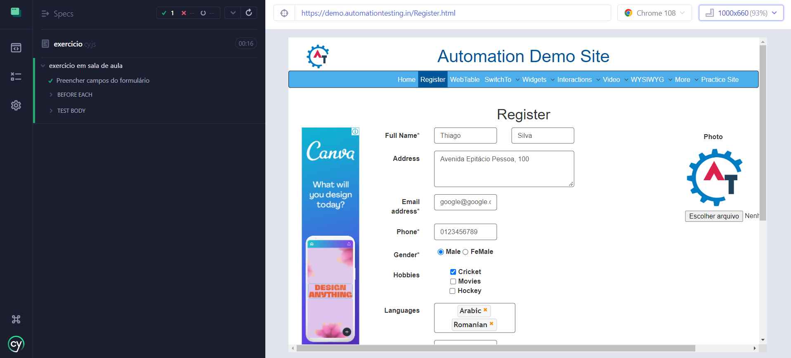

<h1 align="center"> Exercício Minsait </h1>

Resposta ao exercício proposto em sala de aula da Formação em Testes Manuais e Automatizados - Minsait utilizando a ferramenta Cypress.


<p align="center">
  <a href="#-tecnologias">🚀 Tecnologias</a>&nbsp;&nbsp;&nbsp;|&nbsp;&nbsp;&nbsp;
  <a href="#-exercício">💻 Exercício</a>&nbsp;&nbsp;&nbsp;|&nbsp;&nbsp;&nbsp;
  <a href="#-instalação">🔖 Instalação</a>&nbsp;&nbsp;&nbsp;|&nbsp;&nbsp;&nbsp;
  <a href="#memo-licença">:memo: Licença</a>
</p>

<br>

<p align="center">
  
</p>

## 🚀 Tecnologias

Esse projeto foi desenvolvido com a seguinte tecnologia:

- JavaScript

## 💻 Exercício

URL para o teste: https://demo.automationtesting.in/Register.html

<ul>
<li>a. Selecione ao menos 3 elementos usando seleção de CSS;
<li>b. Crie um teste valido;
<li>c. Adicione beforeEach() em seus testes; e
<li>d. Crie um teste para validar envio do formulário com dados inválidos.
</ul>
## 🔖 Instalação

Cypress requer [Node.js](https://nodejs.org/) 

Após instalação do Node, instale as dependências:

```sh
npm install
```

Depois abra o cypress:

```sh
npm run cy:open
```

## :memo: Licença

Esse projeto está sob a licença MIT.

---

Desenvolvido por [Thiago Honorato](https://www.linkedin.com/in/honoratothiago/)
